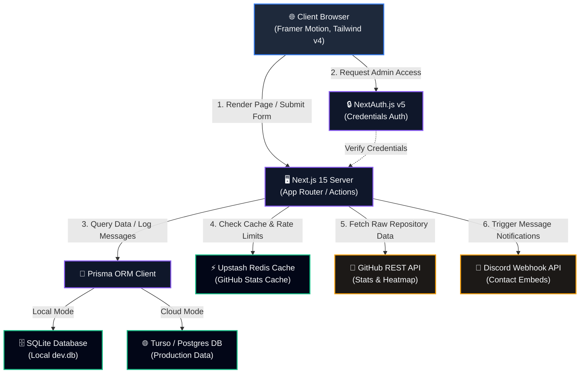

#  Portfolio Platform

> [!CAUTION]
> **PROPRIETARY & CONFIDENTIAL INTELLECTUAL PROPERTY**  
> All content, code, resume files, and media assets within this repository are proprietary. Copying, cloning, redistribution, public hosting, or commercial use is strictly prohibited. Refer to the [LICENSE](file:///c:/Users/Anubhav/OneDrive/Desktop/GITHUB%20PROJECTS%20REFINING/MY_PORTFOLIO/LICENSE) file for complete legal terms.

A state-of-the-art, database-driven developer portfolio platform built using **Next.js 15**, **React 19**, **TypeScript**, **Tailwind CSS v4**, **shadcn/ui**, **Prisma**, and **PostgreSQL (Neon)** / **SQLite (Turso/Local)**. Featuring a minimalist Vercel/Linear dark aesthetic, interactive animations, robust caching, a secure admin panel, and an automated rate-limited contact form.

---

## 📐 System Architecture & Data Workflow

The following diagram illustrates how requests, data, caching, authentication, and external services interact across the platform:



### Key Technical Workflows

1. **Dynamic Content Rendering & Offline Fallback**
   - The home page (`HomePage` in [page.tsx](file:///c:/Users/Anubhav/OneDrive/Desktop/GITHUB%20PROJECTS%20REFINING/MY_PORTFOLIO/nextapp/src/app/page.tsx)) dynamically resolves content. 
   - If a database configuration (`DATABASE_URL` or `TURSO_DATABASE_URL`) is detected, the app retrieves all experience logs, skills, education, certifications, and blogs via Prisma.
   - If connection parameters are absent, it cleanly downgrades to load local TypeScript constant mockups defined in [constants.ts](file:///c:/Users/Anubhav/OneDrive/Desktop/GITHUB%20PROJECTS%20REFINING/MY_PORTFOLIO/nextapp/src/lib/constants.ts), providing a flawless developer portfolio presentation regardless of db state.

2. **Spam-Protected & Reactive Contact form**
   - Contact messages submitted via the UI contact component [Contact.tsx](file:///c:/Users/Anubhav/OneDrive/Desktop/GITHUB%20PROJECTS%20REFINING/MY_PORTFOLIO/nextapp/src/components/sections/Contact.tsx) are client-side validated using a Zod schema.
   - The server actions layer verifies rate limits against an Upstash Redis bucket instance.
   - Upon verification, the message is stored in the database and a rich Discord embed layout is immediately fired to a secure channel webhook (`CONTACT_WEBHOOK_URL`).

3. **Secure Admin Panel & Database CRUD**
   - Admin routes at `/admin` are protected by a NextAuth v5 session wrapper with custom password hashing.
   - The administrator panel exposes forms to add, edit, or delete items inside database tables (skills, projects, experience, blogs, etc.) using Next.js 15 Server Actions.

4. **GitHub Live Syncing**
   - Fetcher processes read user repository configurations, languages, stars, and commit heatmaps directly from the GitHub REST API.
   - Fetch parameters are cached inside Upstash Redis (1-hour TTL) or fallback to a local `GitHubCache` table inside the database to keep page loads lightning-fast.

---

## 📂 Repository Directory Map

Below is a detailed map of the files and directories in the portfolio workspace:

```
MY_PORTFOLIO/
├── nextapp/                     # Main Next.js application workspace
│   ├── prisma/                  # Prisma Database configurations
│   │   ├── schema.prisma        # Database schema definitions (Prisma Client + Adapters)
│   │   ├── seed.ts              # Database seeding scripts with initial mock data
│   │   └── dev.db               # Local SQLite database (git-ignored)
│   ├── src/                     # Application source code
│   │   ├── app/                 # Next.js App Router (pages, api endpoints, layout)
│   │   ├── components/          # React components
│   │   │   ├── admin/           # Dashboard shell, stats widgets
│   │   │   ├── animations/      # Framer-motion particle canvas overlays
│   │   │   ├── sections/        # Home sections (Hero, Projects, Experience, Skills, Blogs, Contact)
│   │   │   └── ui/              # shadcn UI components (sonner, buttons, cards)
│   │   ├── lib/                 # Shared helper libraries (Prisma Client, GitHub API, sound triggers)
│   │   ├── hooks/               # Custom hooks (scroll, active intersection observers)
│   │   ├── actions/             # Safe server actions executing db queries
│   │   └── types/               # Core TypeScript interface declarations
│   ├── public/                  # Public assets served statically
│   │   └── assets/              # PDFs, icons, certificates, click/hover wavs
│   ├── next.config.ts           # Next.js configurations, CSP headers, and optimizations
│   ├── vercel.json              # Vercel deployment presets, custom headers
│   └── components.json          # UI components installation schema
├── Assets/                      # Local duplicate backup folder of media assets
├── _archive/                    # Archived legacy HTML/CSS pages of the static site
├── .github/                     # GitHub Actions CI/CD workflows
├── DEPLOYMENT.md                # Exhaustive guides for Neon, Upstash, and Vercel hosting
├── LICENSE                      # Restricted Confidentiality & Proprietary License
├── package.json                 # Unified workspace script configs for developer commands
└── README.md                    # Core project presentation and guide
```

---

## 🛠️ Unified Root Workflow Commands

The project root contains a `package.json` file configuring unified npm script workflows. **You can manage the entire application directly from the root folder** without needing to manual navigate to subdirectories:

### 1. Prerequisite Setup
Ensure Node.js 20+ is installed. Create a `.env` file in the root folder with database variables (see [Configuration & Environment Setup](#-configuration--environment-setup)).

### 2. Dependency Installation
Install required packages for the workspace:
```bash
npm install
```

### 3. Local Development Server
Launch the Next.js development server at [http://localhost:3000](http://localhost:3000):
```bash
npm run dev
```

### 4. Database Setup & Migrations
Synchronize your local schema structures and generate the local Prisma Client:
```bash
# Generate the Prisma Client
npm run prisma:generate

# Execute SQLite migrations / local updates
npm run prisma:migrate
```

### 5. Seeding Content
Populate your database with the default portfolio entries (skills, certifications, experience, projects):
```bash
npm run prisma:seed
```

### 6. Production Compilation
Verify compilation correctness and prepare a production build:
```bash
npm run build
```

---

## 🔑 Configuration & Environment Setup

Collect the following parameters and populate a `.env.local` inside the `nextapp` folder (or `.env` in the root folder):

```env
# Application Host
NEXT_PUBLIC_APP_URL="http://localhost:3000"
NEXT_PUBLIC_APP_NAME="Anubhav Singh | Portfolio"

# Database Connection (Turso/SQLite or Neon/PostgreSQL)
DATABASE_URL="file:./dev.db" # Local SQLite Database
DIRECT_URL="" # Direct DB connection required for cloud migrations

# Authentication Secret (NextAuth v5)
NEXTAUTH_SECRET="your-generated-32-char-secret-key"
NEXTAUTH_URL="http://localhost:3000"

# Admin Access Credentials
ADMIN_EMAIL="admin@domain.com"
ADMIN_PASSWORD="your-strong-password"

# GitHub Integration Keys
GITHUB_USERNAME="UnknownHawkins"
GITHUB_TOKEN="your-github-personal-access-token"

# Contact Channel Discord Webhook
CONTACT_WEBHOOK_URL="https://discord.com/api/webhooks/your-webhook-id/your-webhook-token"

# Caching & Rate Limiting (Upstash Redis)
UPSTASH_REDIS_REST_URL="https://your-database.upstash.io"
UPSTASH_REDIS_REST_TOKEN="your-upstash-token"
```

For more detailed setup, hosting, and cloud deployment procedures, see the [Deployment Guide](file:///c:/Users/Anubhav/OneDrive/Desktop/GITHUB%20PROJECTS%20REFINING/MY_PORTFOLIO/DEPLOYMENT.md).

---

## 🔒 License and Security

This project contains highly confidential information, including resumes, certifications, personal contact addresses, and proprietary software architecture design.

- **License Terms:** The source code, assets, and text of this repository are covered under a restricted **Proprietary & Confidentiality License**. Any replication, mirroring, reproduction, or distribution without prior explicit authorization from Anubhav Singh is strictly prohibited.
- **Full Legal Agreement:** Review [LICENSE](file:///c:/Users/Anubhav/OneDrive/Desktop/GITHUB%20PROJECTS%20REFINING/MY_PORTFOLIO/LICENSE) for full details.
